Oracle Linux以对Oracle软件和硬件支持较好见长,安装Oracle数据库首选系统，最重要的是Oracle数据库跑在上Oracle Linux性能可以提升超过75%  


<!-- more -->
## 一、安装操作系统

选择第一个安装系统
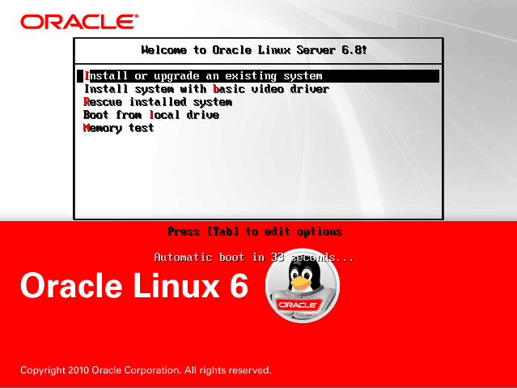

光驱检测选择第二个跳过
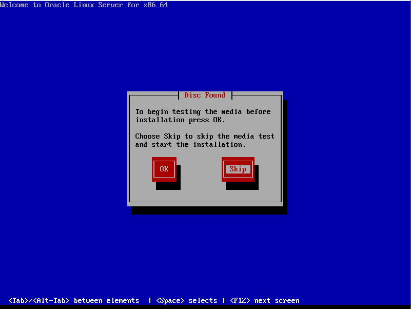

语言选英文，中文会乱码
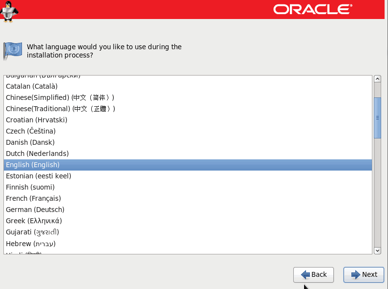

选择第一个基本存储设备


选择第一个“是，忽略数据”


设置Hostname和网络配置


选择时区


设置root密码


选择最后一个，创建自定义布局


创建分区swap，大小是内存的两倍


创建分区boot


把剩余空间放到最后一个分区


选择第二个格式化


选择第二个，将修改写入磁盘


选择桌面Desktop


安装成功重启
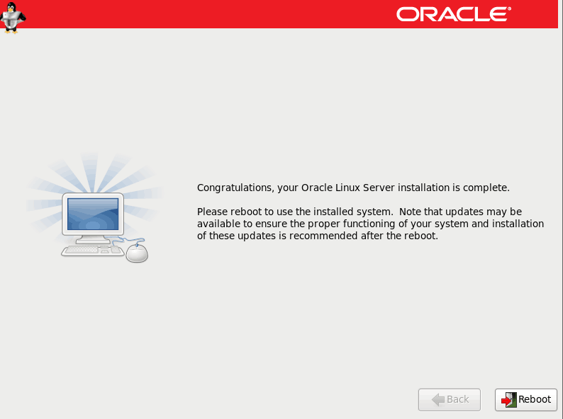

重启后进入欢迎页，注意在这里要选择No


用户可以不创建，看个人情况


内存大可以开启kdump,我没有开启
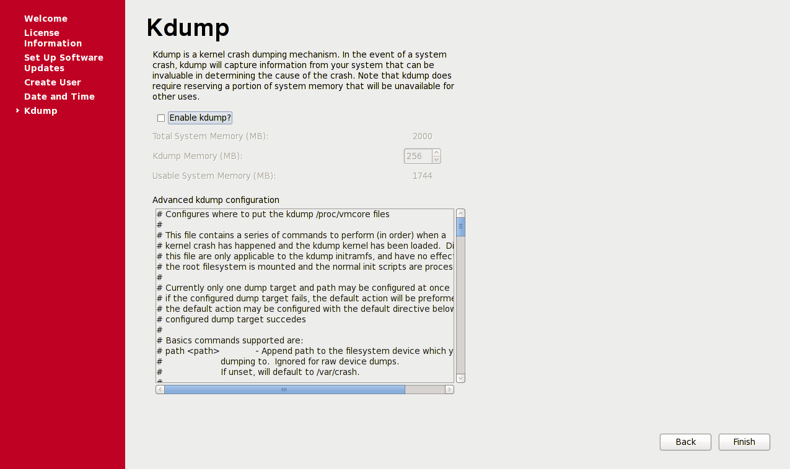

## 二、配置oracle安装环境

### 2.1配置系统环境

```shell
$ vi /etc/sysconfig/network  # 配置主机名
NETWORKING=yes
HOSTNAME=oracle11g
 
$ vi /etc/hosts  #配置host,ip对应主机名
10.5.5.132 oracle11g

$ service iptables stop  # 关闭防火墙
$ chkconfig iptables off

$ vi /etc/selinux/config  # 关闭selinux
SELINUX=disabled
 
$ mkdir -p /soft/yum  # 创建软件目录
```

### 2.2配置yum源

先拷贝镜像到/soft/目录，然后执行下面的命令

```shell
$ mount -o loop -t iso9660 /soft/oraclelinux6.8.iso /soft/yum  # 挂载镜像
$ cd /etc/yum.repos.d/  # 进入yum源目录
$ mv public-yum-ol6.repo public-yum-ol6.repo.bak  # 备份源软件源
$ vi /etc/yum.repos.d/local.repo
[HighAvailability]
name=HighAvailability
baseurl=file:///soft/yum/HighAvailability
enabled=1
gpgcheck=0

[LoadBalancer]
name=LoadBalancer
baseurl=file:///soft/yum/LoadBalancer
enabled=1
gpgcheck=0

[ResilientStorage]
name=ResilientStorage
baseurl=file:///soft/yum/ResilientStorage
enabled=1 
gpgcheck=0

[Server]
name=Server
baseurl=file:///soft/yum/Server
enabled=1
gpgcheck=0

# 重新加载yum
$ yum clean all
$ yum makecache
$ yum list

$ yum install -y oracle-rdbms-server-11gR2-preinstall  # 安装依赖包

# 创建目录
$ mkdir -p /u01/app/oracle
$ chown -R oracle:oinstall /u01/app/oracle
$ chmod -R 775 /u01/app/oracle
$ mkdir -p /u01/app/oraInventory
$ chown -R oracle:oinstall /u01/app/oraInventory
$ chmod -R 775 /u01/app/oraInventory
```

### 2.3配置oracle用户环境变量

```shell
$ su - oracle  # 切换到oracle用户
$ vi .bash_profile # 配置环境变量
TMP=/tmp; export TMP
TMPDIR=$TMP; export TMPDIR
ORACLE_BASE=/u01/app/oracle; export ORACLE_BASE
ORACLE_HOME=$ORACLE_BASE/product/11.2.0/db_1; export ORACLE_HOME
ORACLE_SID=orcl; export ORACLE_SID
ORACLE_TERM=xterm; export ORACLE_TERM
PATH=/usr/sbin:$PATH; export PATH
PATH=$ORACLE_HOME/bin:$PATH; export PATH
LD_LIBRARY_PATH=$ORACLE_HOME/lib:/lib:/usr/lib;  export LD_LIBRARY_PATH
CLASSPATH=$ORACLE_HOME/JRE:$ORACLE_HOME/jlib:$ORACLE_HOME/rdbms/jlib; export CLASSPATH
if [ $USER = "oracle" ]; then
   if [ $SHELL = "/bin/ksh" ]; then
       ulimit -p 16384
       ulimit -n 65536
    else
       ulimit -u 16384 -n 65536
   fi
fi

$ source .bash_profile  # 让环境变量立即生效
```

### 2.4进入安装oracle

安装前先重启系统，然后用oracle用户登录

```shell
$ reboot #重启
$ cd /soft/  # 进入刚才上传的文件目录
$ unzip p13390677_112040_Linux-x86-64_1of7.zip  #解压缩
$ unzip p13390677_112040_Linux-x86-64_2of7.zip
$ cd /soft/database
$ ./runInstaller  # 开始安装
```

## 三、安装oracle

取消勾选
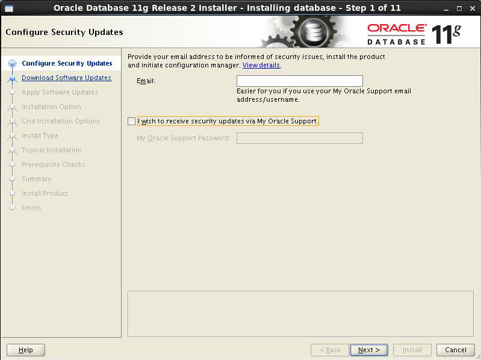

选择跳过
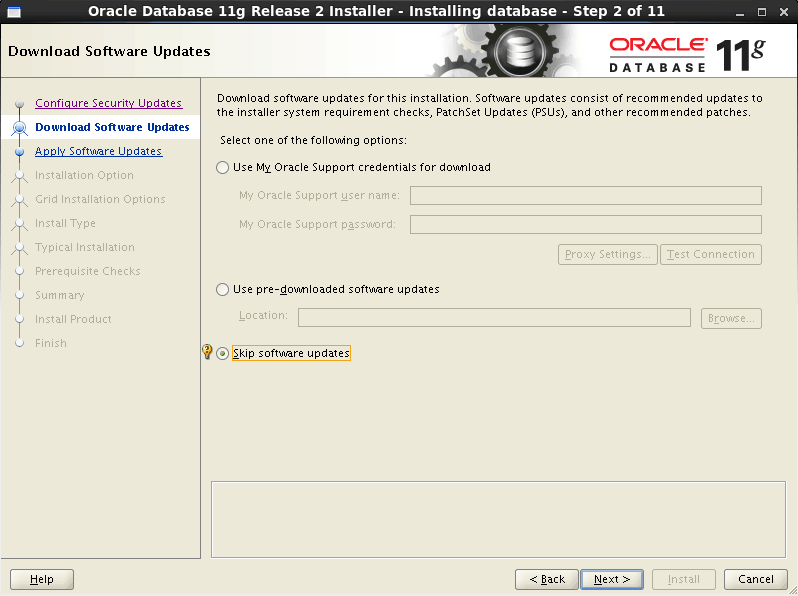

选择只安装软件


选择创建单实例的数据库安装
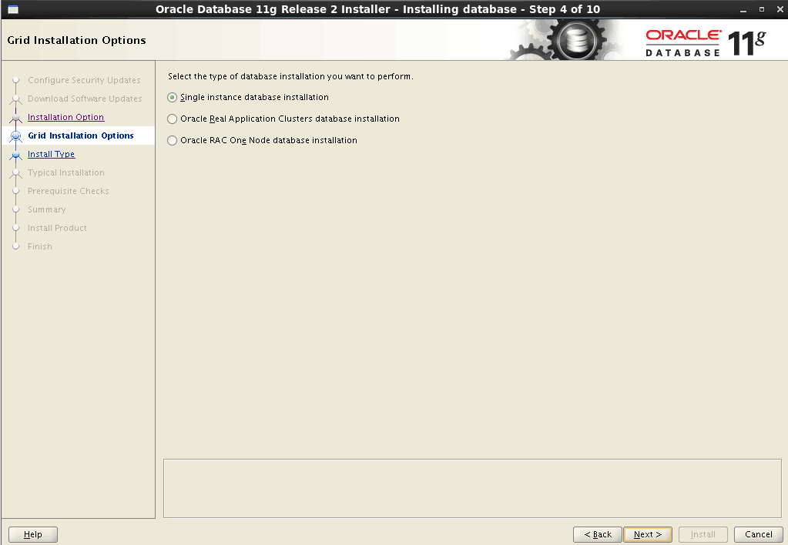

安装语言使用默认英文


选择安装企业版
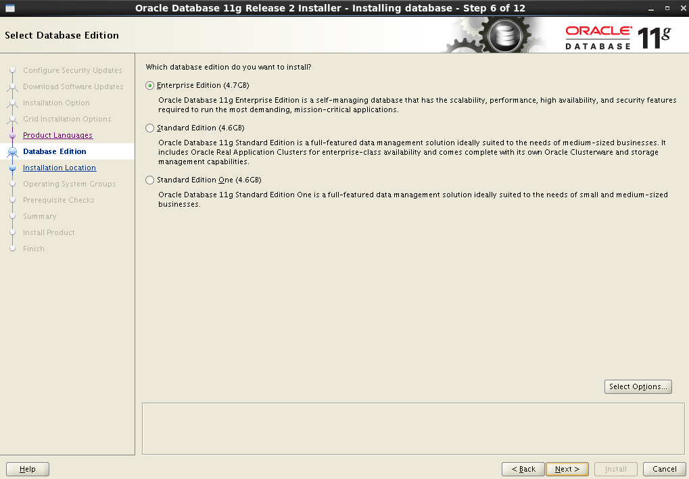

Oracle安装路径自动识别到了配置的变量，下一步
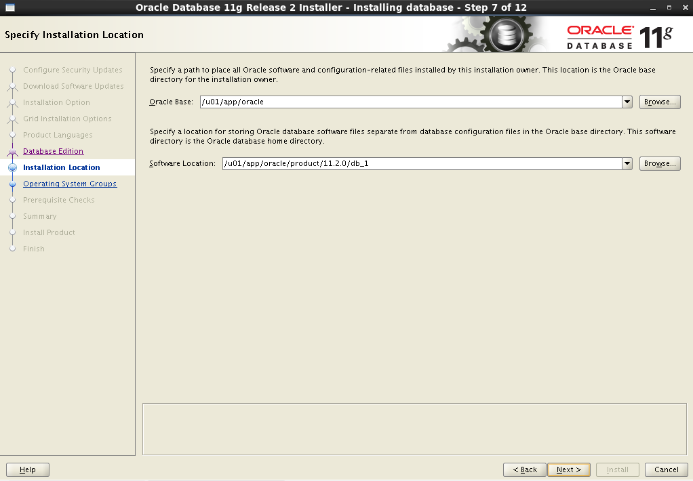

安装文件的路径文件目录，自动识别。下一步


选择组的所属，下一步


点击安装


等待安装完成
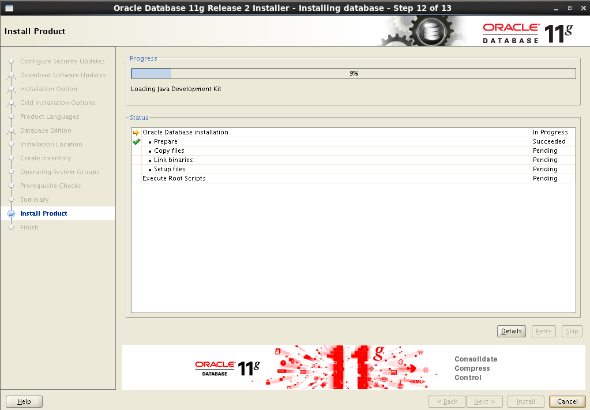

提示需要root用户执行以下的脚本


打开命令窗口执行脚本
```sh
su               #切换到root用户
/u01/app/oraInventory/orainstRoot.sh   #执行第一个脚本
/u01/app/oracle/product/11.2.0/db_1/root.sh   #执行第二个脚本
```
执行完去安装窗口点确认

安装完成，点击关闭


## 四、配置和使用

```shell
$ dbca  # 配置数据库
```

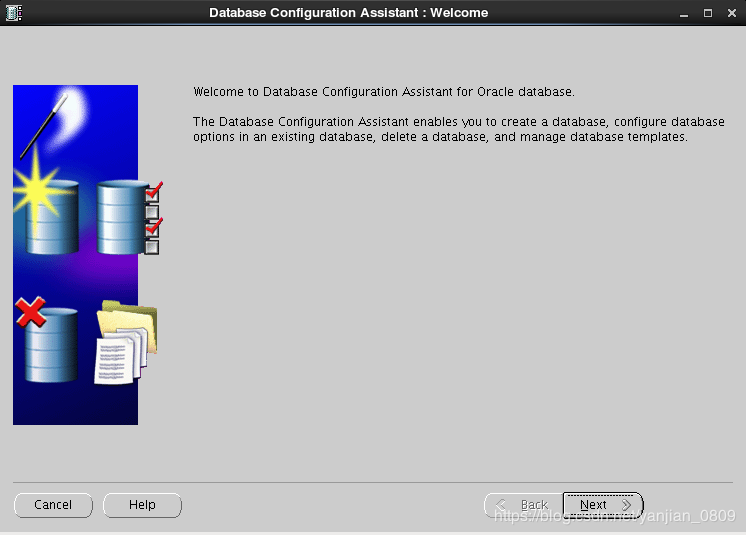

选择创建数据库


这里选第一个和第二个都可以，第一个是一般事务数据，第二个是定制数据库。我这里选定制数据库
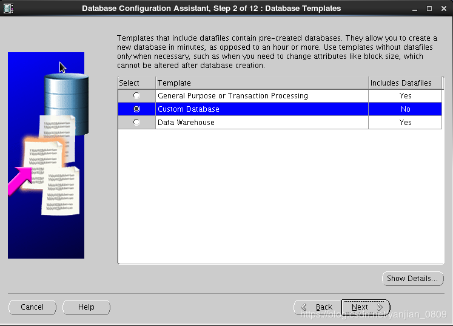

填写数据库实例名称


取消勾选然后下一步


选择统一的密码，然后自己设置密码


默认需要8位密码，不满8位也可以强制设置


选择数据库文件类型和位置，我这里默认


指定数据库快速恢复区，我不需要，取消勾选
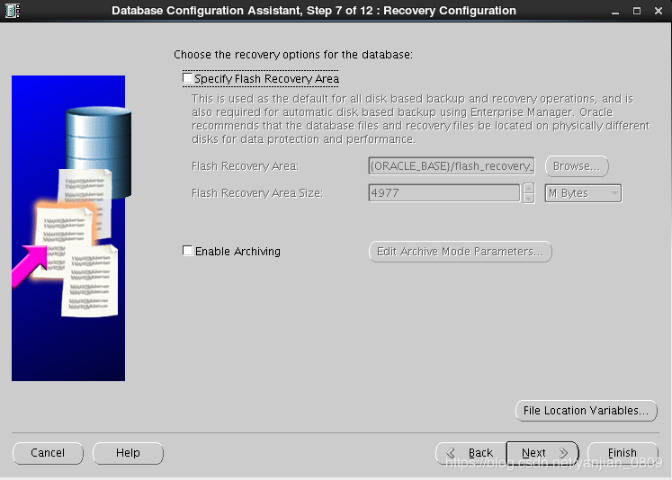

数据库组件，取消勾选
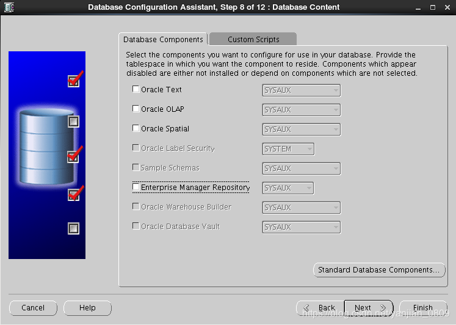

根据需要配置内存，我的配置如图，取消勾选自动记录


根据需要设置最大的连接进程数


配置字符集，因为自己的数据库里用了中文，所以我配置了简体中文，下一步


设置日志组大小等，下一步


创建数据库，完成


确定


开始安装数据库
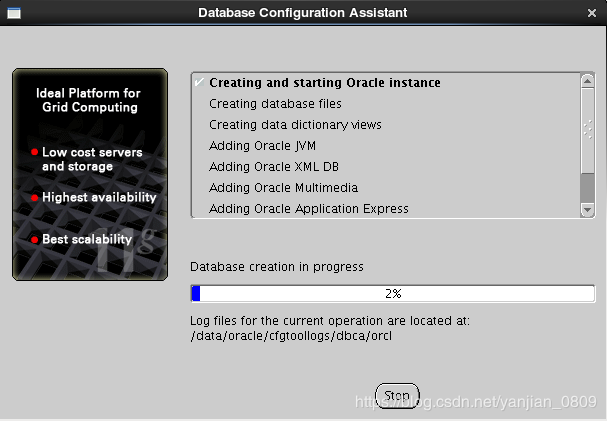

点击退出，安装完成


```shell
$ netca  # 配置监听及本地网络服务
```


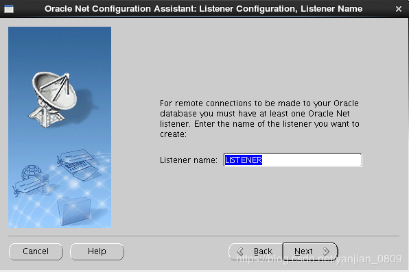


监听设置存储在\data\oracle\product\10.2.0\db_1\NETWORK\ADMIN\listener.ora

接下来配置远程服务：


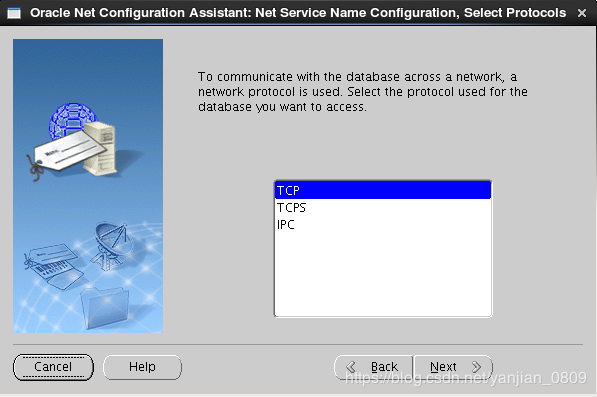


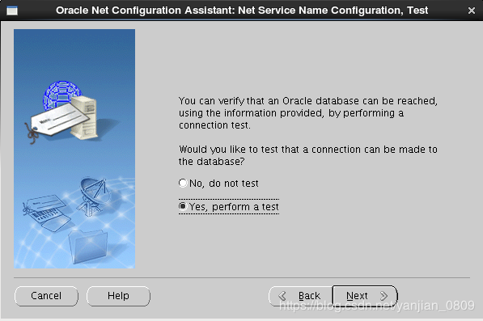

注意：若测试不成功有可能是用户登录出错，点击 change login，用户名输入：system，密码输入前面创建数据库时设置的密码


## 五、启动数据库

```shell
$ ln -s /u01/app/oracle/product/11.2.0/db_1/bin/sqlplus /usr/bin  # 把sqlplus in到/usr/bin目录，方便使用

# 切换到oracle /bin 目录，
$ cd $ORACLE_HOME/bin
# 启动监听
$ lsnrctl start
# 查看监听状态
$ lsnrctl status
# lsnrctl stop命令可以关闭监听

# 启动数据库
$ sqlplus /nolog
SQL> connect /as sysdba
SQL> startup
# shutdown immediate 命令来关闭数据
```

如果要关闭数据库可以用oracle的shutdown命令用来关闭当前实例，有4个可选参数：normal、transactional、immediate和abort。不带参数时默认是normal。  
这几个参数的差异体现在以下几个维度：  
是否允许新的连接；  
当前已连接的回话是否自动断开；  
当前未提交的事务是等待用户提交完成还是自动回滚；  
关闭时是否需要做检查点；  
启动时是否需要进行实例恢复。  

shutdown normal：不允许新的连接、等待会话结束、等待事务结束、做一个检查点并关闭数据文件。启动时不需要实例恢复。  
shutdown transactional：不允许新的连接、不等待会话结束、等待事务结束、做一个检查点并关闭数据文件。启动时不需要实例恢复。  
shutdown immediate：不允许新的连接、不等待会话结束、不等待事务结束、做一个检查点并关闭数据文件。没有结束的事务是自动rollback的。启动时不需要实例恢复。  
shutdown abort：不允许新的连接、不等待会话结束、不等待事务结束、不做检查点且没有关闭数据文件。启动时自动进行实例恢复。  

## 六、创建表空间和用户

```shell
$ sqlplus / as sysdba

# 查询临时表空间文件的绝对路径。如果需要的话，可以通过查询来写定绝对路径。一般用${ORACLE_HOME}就可以了
SQL> select name from v$tempfile;

# 创建临时表空间‘OACESHI_TEMP’
SQL> create temporary tablespace OACESHI_TEMP tempfile
'${ORACLE_HOME}/oradata/OACESHI_TEMP.bdf' size 100m reuse autoextend on next 20m
maxsize unlimited;

# 查询用户表空间文件的绝对路径
SQL> select name from v$datafile;

# 创建表空间‘OACESHIDB’
SQL> create tablespace OACESHIDB datafile '${ORACLE_HOME}/oradata/OACESHIDB.bdf' size 100M
reuse autoextend on next 40M maxsize unlimited default storage(initial 128k next 128k
minextents 2 maxextents unlimited);

# 创建用户‘OACESHI’和密码‘OACESHI’，指定上边创建的临时表空间和表空间
SQL> create user OACESHI identified by OACESHI default tablespace OACESHIDB temporary tablespace OACESHI_TEMP;

# 赋予权限
SQL> grant connect,resource to OACESHI;
SQL> grant create any view to OACESHI;

# 或者快速创建dba用户
SQL> create user TEST identified by TEST;
SQL> grant connect,resource to TEST;
```

## 七、问题解决

注意：  
操作监听和数据库都需要切换到oracle用户下  
操作数据库还需要通过sqlplus，以管理员身份登录到oracle  

plsql连接时无监听程序
<https://www.linuxidc.com/Linux/2017-10/147393.htm>
