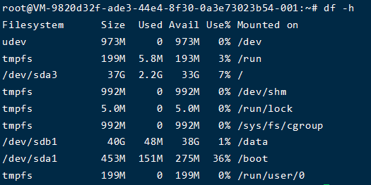

操作前先要添加一块硬盘

查看硬盘位置
```
sudo fdisk -l
```


根据磁盘大小，我挂的是40g的，所以很明显是 `/dev/sdb`  

<!-- more -->
格式化
```
sudo mkfs.ext4  /dev/sdb
```

进入命令行
```
sudo fdisk /dev/sdb
```

命令行输入
```
n   #添加新分区
p   #设置主分区
#敲3次回车
t   #更改分区类型，可输入L查看所有分区类型编号
83  #linux类型分区
w   #保存退出
```

查看新分区,可以看到新分区是`/dev/sdb1`
```
sudo fdisk -l
```


在根下创建目录/data，再挂载它
```
sudo mkdir /data 
sudo mount /dev/sdb1 /data
```

查看硬盘UUID号,记下`/dev/sdb1`的UUID
```
sudo blkid
```

编辑配置文件，使机器重启可以自动挂载
```
sudo vim /etc/fstab
```

在最后一行添加：
```
UUID=3cbb0105-2d20-444e-9186-3c1ce30239fb /data           ext4    defaults        0       0
```
注：格式为 设备名称 挂载点 分区类型 挂载选项 dump选项 fsck选项
dump选项–这一项为0，就表示从不备份。如果上次用dump备份，将显示备份至今的天数。
fsck选项 –启动时fsck检查的顺序。为0就表示不检查，（/）分区永远都是1，其它的分区只能从2开始，当数字相同就同时检查（但不能有两1）


输入`df -h` 可以检验磁盘大小

