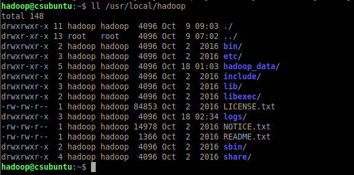
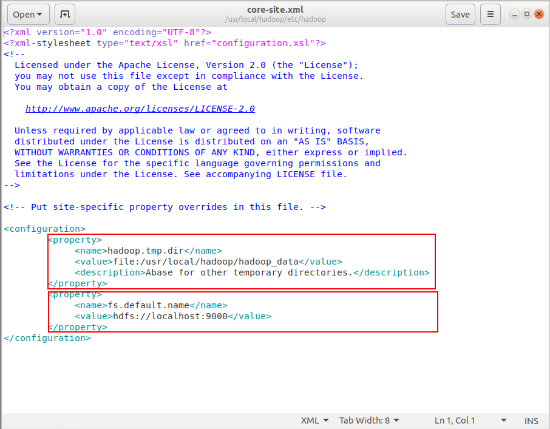
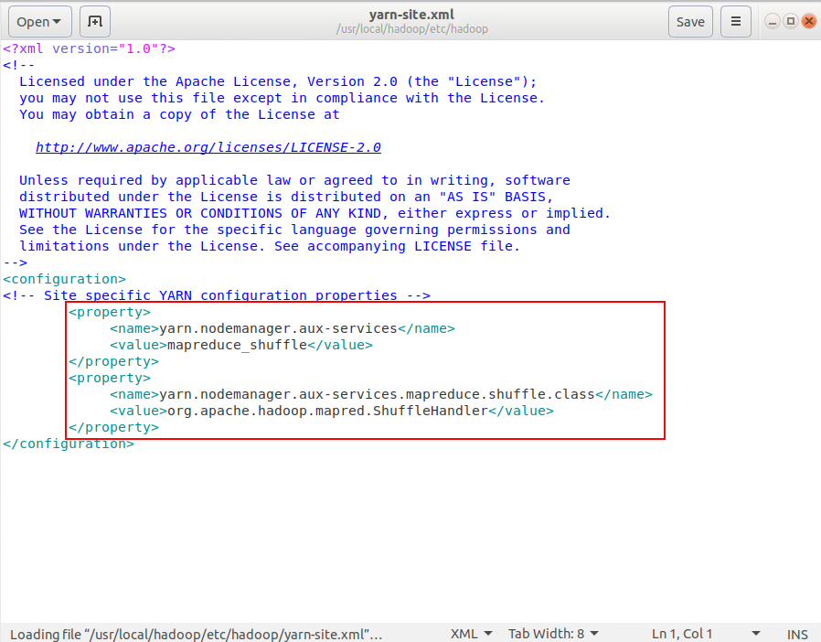

## 一、准备
### 1.1创建Hadoop用户
```shell
$ sudo useradd -m hadoop -s /bin/bash  #创建hadoop用户，并使用/bin/bash作为shell
$ sudo passwd hadoop                   #为hadoop用户设置密码，之后需要连续输入两次密码
$ sudo adduser hadoop sudo             #为hadoop用户增加管理员权限
$ su - hadoop                          #切换当前用户为用户hadoop
$ sudo apt-get update                  #更新软件包信息
```
### 1.2设置SSH无密码登录
```shell
$ sudo apt-get install openssh-server   #安装SSH server
$ ssh localhost                         #登陆SSH，第一次登陆输入yes
$ exit                                  #退出登录的ssh localhost
$ cd ~/.ssh/                            #如果没法进入该目录，执行一次ssh localhost
$ ssh-keygen -t rsa　                   #产生秘钥进行后续身份验证，需三次回车确认
```
将产生的Key放到许可证文件中
```shell
$ cat ./id_rsa.pub >> ./authorized_keys #加入授权
$ ssh localhost                         #此时已不需密码即可登录localhost
```
## 二、安装JDK
```shell
$ java -version				            #查看当前java版本，未出现版本信息代表未安装
$ sudo apt-get install default-jdk		#使用apt-get安装JDK
$ java -version                         #再次查询Java版本，查看是否安装成功
```
查询java安装路径路径，记住该路径，下面步骤中的配置要用到
```shell
$ update-alternatives --display java
```


## 三、下载安装Hadoop
```shell
$ Wget http://archive.apache.org/dist/hadoop/core/hadoop-2.6.4/hadoop-2.6.4.tar.gz    #下载hadoop
$ sudo tar -zxvf hadoop-2.6.4.tar.gz         #解压缩
$ sudo mv hadoop-2.6.4 /usr/local/hadoop     #将hadoop移动到/usr/local/hadoop
$ ll  /usr/local/hadoop                      #查看hadoop安装目录
```


* bin是运行文件目录，包括Hadoop、HDFS和YARN
* sbin是shell文件目录，包括start-all.sh、stop-all.sh
* etc/hadoop目录包含hadoop配置文件
* lib是hadoop函数库目录
* logs系统日志目录

## 四、设置Hadoop环境变量
在终端输入命令打开编辑器
```shell
$ sudo gedit ~/.bashrc
```
在编辑器中输入下面内容
```python
# 设置jdk安装路径，参考安装jdk的部分输出的路径
export JAVA_HOME=/usr/lib/jvm/java-8-openjdk-amd64
# 设置HADOOP_HOME为安装路径
export HADOOP_HOME=/usr/local/hadoop
#设置PATH
export PATH=$PATH:$HADOOP_HOME/bin
export PATH=$PATH:$HADOOP_HOME/sbin
# 其他环境变量
export CLASSPATH=$($HADOOP_HOME/bin/hadoop classpath):$CLASSPATH
export HADOOP_MAPRED_HOME=$HADOOP_HOME
export HADOOP_COMMON_HOME=$HADOOP_HOME
export HADOOP_HDFS_HOME=$HADOOP_HOME
export YARN_HOME=$HADOOP_HOME
# 连接库相关设置
export HADOOP_COMMON_LIB_NATIVE_DIR=$HADOOP_HOME/lib/native
export HADOOP_OPTS="-DJava.library.path=$HADOOP_HOME/lib"
export JAVA_LIBRARY_PATH=$HADOOP_HOME/lib/native:$JAVA_LIBRARY_PATH
```
在编辑器中输入后，然后按ctrl+s保存，再关闭编辑器


让设置立即生效
```shell
$ source ~/.bashrc
```

或者使用vim编辑器，点击键盘"i", 就能开始编辑。输入配置文件内容后，点击键盘"esc"键，然后输入`：wq`来保存退出
```shell
$ sudo vim --version              #检查是否安装vim
$ sudo apt-get install vim        #安装vim
$ sudo vim ~/.bashrc              #编辑.bashrc
```


## 五、修改Hadoop配置文件
编辑hadoop-env.sh
```shell
$ sudo gedit /usr/local/hadoop/etc/hadoop/hadoop-env.sh
```
设置JAVA_HOME的路径，参考安装jdk的部分输出的路径，编辑完成保存退出


修改core-site.xml文件
```xml
<configuration>
        <property>
             <name>hadoop.tmp.dir</name>
             <value>file:/usr/local/hadoop/hadoop_data</value>
             <description>Abase for other temporary directories.</description>
        </property>
        <property>
             <name>fs.default.name</name>
             <value>hdfs://localhost:9000</value>
        </property>
</configuration>
```

```shell
$ sudo gedit /usr/local/hadoop/etc/hadoop/core-site.xml
```
第一个节点是临时目录，第二个节点是HDFS默认名称


编辑yarn-site.xml
```xml
<configuration>
<!-- Site specific YARN configuration properties -->
        <property>
             <name>yarn.nodemanager.aux-services</name>
             <value>mapreduce_shuffle</value>
        </property>
        <property>
             <name>yarn.nodemanager.aux-services.mapreduce.shuffle.class</name>
             <value>org.apache.hadoop.mapred.ShuffleHandler</value>
        </property>
</configuration>
```

```shell
$ sudo gedit /usr/local/hadoop/etc/hadoop/yarn-site.xml
```


编辑mapred-site.xml，mapred-site.xml用于监控Map与Reduce程序的JobTracker任务分配情况以及TaskTracker任务运行情况
```xml
<configuration>
        <property>
             <name>mapreduce.framework.name</name>
             <value>yarn</value>
        </property>
</configuration>
```
```shell
$ sudo cp /usr/local/hadoop/etc/hadoop/mapred-site.xml.template /usr/local/hadoop/etc/hadoop/mapred-site.xml            #复制模板文件
$ sudo gedit /usr/local/hadoop/etc/hadoop/mapred-site.xml
```
这个节点是设置mapreduce框架为yarn


编辑 hdfs-site.xml
```xml
<configuration>
		<property>
		   <name>dfs.replication</name>
		   <value>1</value>
		</property>
		<property>
		   <name>dfs.namenode.name.dir</name>
		   <value>file:/usr/local/hadoop/hadoop_data/hdfs/namenode</value>
		</property>
		<property>
		   <name>dfs.datanode.data.dir</name>
		   <value>file:/usr/local/hadoop/hadoop_data/hdfs/datanode</value>
		</property>
</configuration>
```

```shell
$ sudo gedit /usr/local/hadoop/etc/hadoop/hdfs-site.xml
```
第一个节点是设置blocks副本备份数量，第二个是NameNode数据存储目录，第三个是DataNode数据存储目录


## 六、创建并格式化HDFS目录

```shell
$ sudo mkdir -p /usr/local/hadoop/hadoop_data/hdfs/namenode   #创建namenode数据存储目录
$ sudo mkdir -p /usr/local/hadoop/hadoop_data/hdfs/datanode   #创建datanode数据存储目录
$ sudo chwn -R hadoop /usr/local/hadoop               #修改Hadoop目录所有者为hadoop
$ hadoop namenode -format                             #格式化HDFS
```

## 七、启动Hadoop
```shell
$ start-dfs.sh                    #启动HDFS
$ start-yarn.sh                   #启动Hadoop MapReduce框架Yarn
```
或者同时启动
```shell
$ start-all.sh
```
输入`jps`查看进程是否启动


查看Hadoop ResourceManager Web页面，打开浏览器输入 http://localhost:8088/


查看NameNode HDFS Web页面，打开浏览器输入 http://localhost:50070/


## 八、遇到的问题和解决办法
在安装完成后发现namenode进程没有启动，打不开 http://localhost:50070/ 页面。首先去查看日志
```
$ cd /usr/local/hadoop/logs                   #进入日志目录
$ sz hadoop-hadoop-namenode-csubuntu.log      #下载日志
```


发现是9000端口被占用
```
sudo netstat -lnp | grep 9000           #查看9000端口占用
```


看到是nginx占用了9000端口,把nginx停止就能重新启动hadoop
```
$ ps -ef | grep nginx                      #查看nginx主进程
$ kill -9 主进程号                          #强制停止Nginx
```


启动hadoop守护进程

