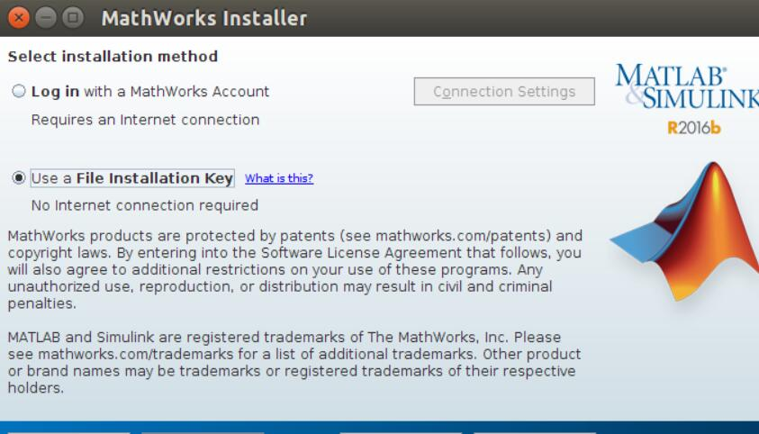
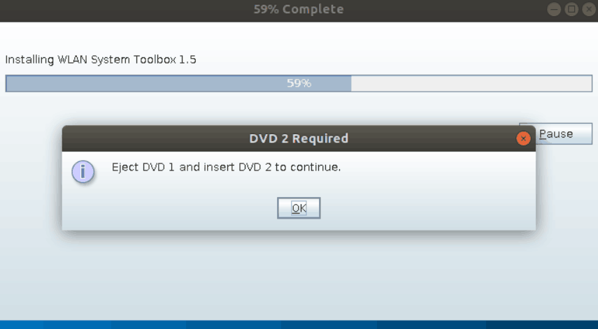

## 下载Matlab2018b

<https://blog.csdn.net/weixin_41038644/article/details/84668127>

## 开始安装

创建文件夹

```shell
mkdir Matlab
```

挂载第一个镜像

```shell
sudo mount -o loop R2018b_glnxa64_dvd1.iso ./Matlab
```

运行目录下的`install`开始安装

```shell
cd ~  # 先跳出目录
sudo /root/Downloads/Matlab/install
```

选择文件安装密钥


填写密钥`09806-07443-53955-64350-21751-41297`


选择目录后，点击下一步开始安装。安装到一半会弹框提示需要dvd2才能继续


弹出dvd1

```shell
sudo umount Matlab
```

挂载dvd2

```shell
sudo mount -o loop R2018b_glnxa64_dvd2.iso ./Matlab
```

安装成功后弹出dvd2

```shell
sudo umount Matlab
```

## 破解Matlab

解压破解文件

```shell
unzip MATLAB_R2018b_Linux64_Crack.zip
```

运行matlab

```shell
sudo /usr/local/MATLAB/R2018b/bin/matlab
```

选择离线激活


选择刚才解压的`license_standalone.lic`文件


激活成功后,再把破解包里的文件替换到matlab完成破解

```shell
cp libmwlmgrimpl.so /usr/local/MATLAB/R2018b/bin/glnxa64/matlab_startup_plugins/lmgrimpl/
```

## 添加一个快捷方式

```shell
sudo vim /usr/share/applications/Matlab2018b.desktop
```

按`i`进入编辑后输入下面内容，然后按`ESC`输入`:wq`保存退出

```python
#!/usr/bin/env xdg-open
[Desktop Entry]
Type=Application
Icon=/usr/local/MATLAB/R2018b/toolbox/shared/dastudio/resources/MatlabIcon.png
Name=MATLAB R2018b
Comment=Start MATLAB - The Language of Technical Computing
Exec=/usr/local/MATLAB/R2018b/bin/matlab
Categories=Development;Math;Science
```
