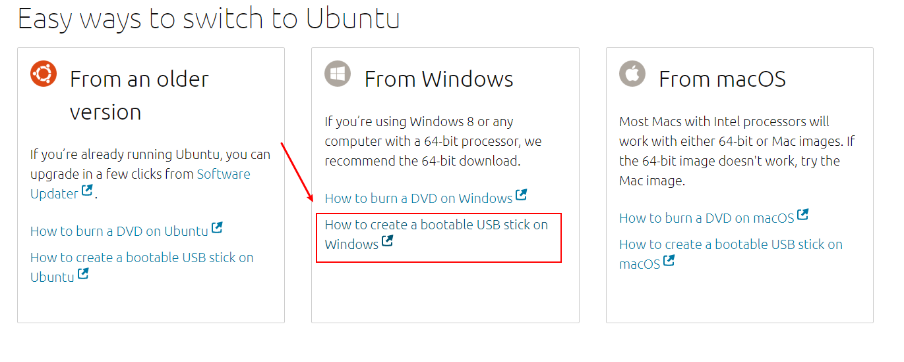
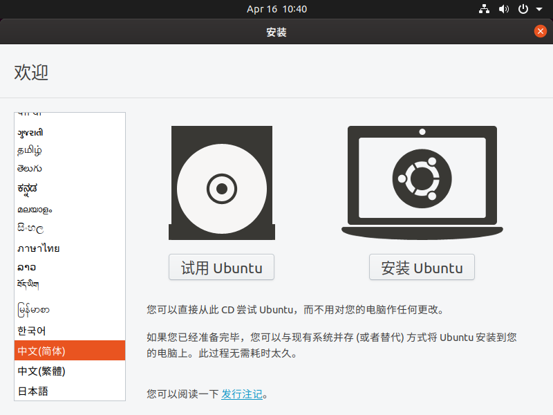
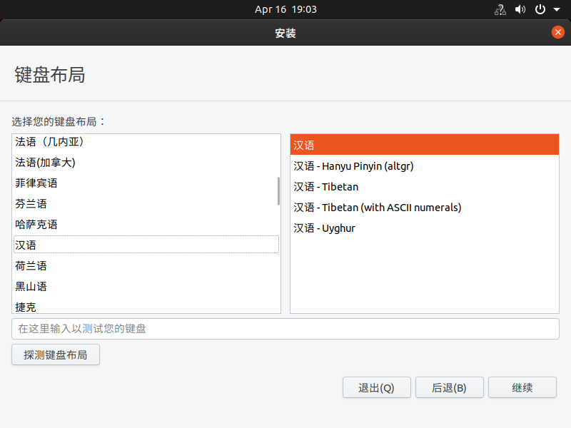
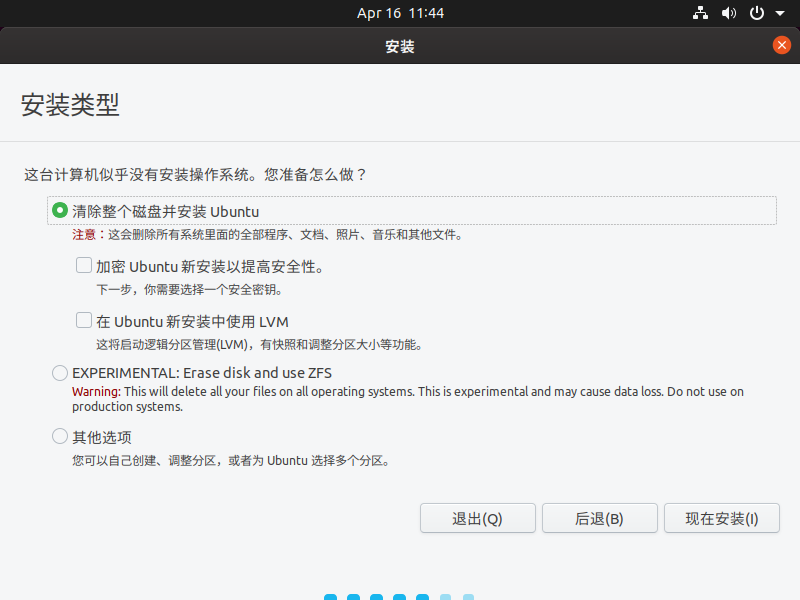
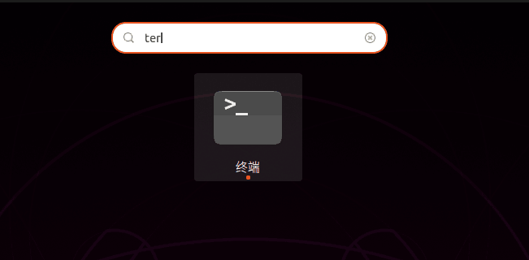
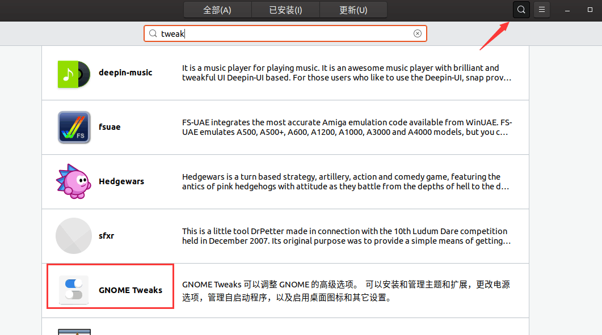
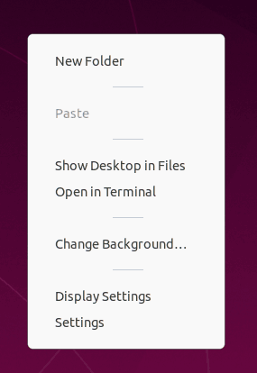
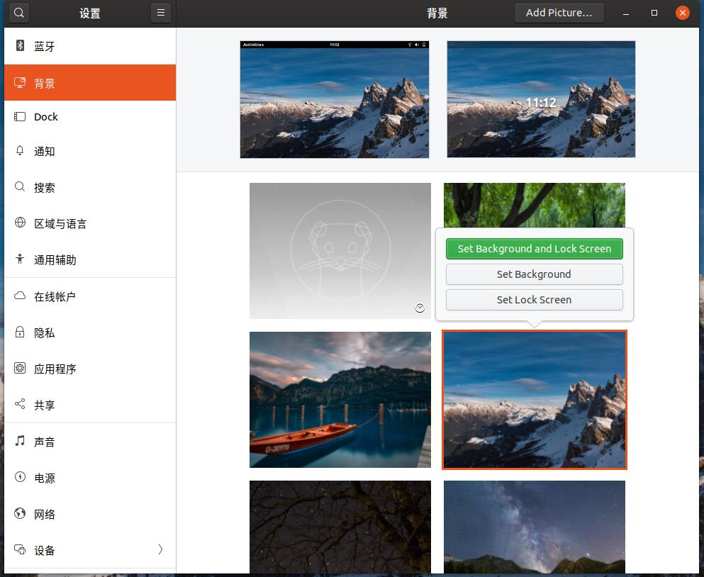

ubuntu在个人工作站与服务器领域都表现的非常稳定优秀，工程师使用ubuntu做为个人开发电脑完全没有问题，功能齐全性能稳定，因为用户众多解决问题也比较容易。

<!-- more -->
## 下载
从官网下载[https://ubuntu.com/download/desktop](https://ubuntu.com/download/desktop)

## 制作u盘启动盘
点击链接

选择第二步，下载工具

点击下载

双击打开刚才下载的工具，选择镜像后点开始制作

## 安装系统
重启电脑按f12选择u盘启动，根据自己主板可能其他按键

如果要装双系统可以选择其他选项

等待安装完成

## 设置镜像源
打开软件和更新

选择下载服务器为阿里云

等待完成

## 更新系统
打开软件更新器，更新系统

执行系统更新

重启

## 使用终端
打开终端

安装常用软件vim,git,php

## 设置桌面
在软件里面找到tweaks工具，用来设置ubuntu桌面

进入安装页面选择安装

打开刚才下载的工具，设置不显示桌面图标

设置顶栏显示时间和电池百分比

在桌面右击打开显示设置

选择一个桌面背景

单击设置为桌面背景

设置dock栏显示在底部和自动隐藏

## 设置主题
访问 https://www.pling.com/p/1136805/ ,安装主题工具

选择打开

等待完成出现安装

安装完成

访问https://vinceliuice.github.io/ ，选择一个主题

我选择mac主题

用终端下载安装图标

使用tweaks工具设置主题和图标

## 安装vscode
安装vscode,选择下载deb

安装

打开vscode商店，安装sync同步工具，点击`Download Public Gist`输入`86120a7addb2aa40b20514be7d130991`开始同步

## 安装字体
下载字体

打开安装
