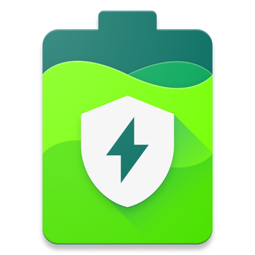

精准电量「Accubattery」Pro 是一款非常好用的电池健康检测维护管理软件，其基于一系列科学的研究和测试，能测试出设备电池的实际容量，并查看电池损耗，而且还可以通过设置充电到达百分数「Accubattery 建议是80%」提醒拔掉充电器，实现保护充电增加电池循环寿命，从而让您的电池保持健康。

<!-- more -->
专业版还有检测电池寿命、充放电速度、温度、电压等众多的功能。

## 特色功能：
* 电池健康。  
电池的寿命是有限的。每次给装置充电，都会损耗电池，降低电池的总容量。科学研究表明，只将手机电池最多充到80%，能将电池寿命延长到200%。  
通过使用我们的充电警告延长电池寿命。  
发现充电中的电池损耗。  
* 电池使用情况。  
通过利用电池充电控制器提供的信息，AccuBattery可以测量出电池的实际使用情况 。将结果同在前台运行的应用信息相结合，可以确定每个应用的耗电量。Android测算电池耗电量是通过设备制造商提供的参数，比如，CPU消耗电多大。而实际上，这些测算值会有很大的偏差。  
监控手机目前用电情况。  
了解工作或待机状态下，手机能使用多长时间。  
了解每个应用的耗电情况。  
查看手机从休眠状态转为唤醒状态的频率。  
* 充电速度。  
用AccuBattery为手机找到最快的充电器和USB连接线。通过充电电流（以毫安为单位）来发现！  
查看手机显示屏开或关时的充电速度。  
了解手机充电要多长时间，到几点钟可以充满。

## 专业版功能
- 实时CPU和电量使用情况叠加层，找出费电的进程。
- 通过深色和AMOLED黑主题来省电。
- 访问昨天之前的充电历史。
- 通知中详细的电池统计数据。

## 关于此破解专业版：
感谢国外kirlif大神的修改和分享；

* 解锁所有专业版功能。
* 删除软件内所有广告。

## 关于只将手机电池最多充到80%，能将电池寿命延长到200%：
相信好多人对于只充电到80%就能提高电池寿命的说法存在异议！那么 AccuBattery 宣称只将手机电池最多充至80%能将电池寿命延长到200%是否有科学依据呢？

众所周知，现在的手机、平板设备都是用的三元锂电池，而三元锂电池浅充、浅放能使循环寿命长是经过大量试验验证过的。通常三元锂电池单体充放电循环次数大约是500次，这里的循环次数是按100%-0%的容量进行的。大量的试验证明假设您每次只使用50%的电量，那么循环次数会大大提升。

另外循环寿命还受到充电的电压的影响，例如充电电压为2V时的循环寿命比4V有了明显的提升，如果进一步降低充满电压到1V，循环寿命又会进一步提升。而且目前大部分锂电池电动汽车日常充电程序都有相关的设置，例如特斯拉就将日常充电容量设为80%。

所以综上所述只将手机电池最多充到80%相比充到100%一定能延长电池的循环寿命，具体能不能达到延长到200%的效果，还受到您的放电、充电电压等因素的影响。

## 下载地址
链接：https://pan.baidu.com/s/1T9twwSZXEVH_IwYzq2j_MA 
提取码：rrhc 